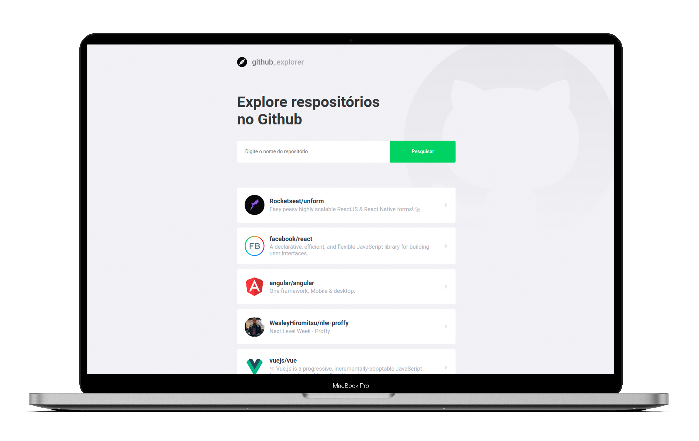

<p align="center">
   
</p>

<p align="center">
   <a href="https://www.linkedin.com/in/wesley-hiromitsu-14b52914a/">
      
   </a>

   <a href="mailto:hiromitsu.dev@gmail.com">
      
   </a>

  

  
</p>

<div align="center">
   Github_explorer, GoStack.
</div>

<p align="center">
  
</p>

<p align="center">
  <a href="#clipboard-sobre-o-projeto">Sobre o Projeto</a>&nbsp;&nbsp;&nbsp;|&nbsp;&nbsp;&nbsp;
  <a href="#art-layout">Layout</a>&nbsp;&nbsp;&nbsp;|&nbsp;&nbsp;&nbsp;
  <a href="#computer-tecnologias-utilizadas">Tecnologias</a>&nbsp;&nbsp;&nbsp;|&nbsp;&nbsp;&nbsp;
  <a href="#rocket-como-rodar-o-projeto">Como rodar o projeto</a>&nbsp;&nbsp;&nbsp;|&nbsp;&nbsp;&nbsp;
  <a href="#closed-book-licença">Licença</a>
</p>

## :clipboard: Sobre o Projeto

Github-explorer, projeto de estudo feito para manipular dados da api do github.

## :art: Layout

Você pode duplicar o layout do projeto no Figma.

- <div style="display:flex;align-items:center;">
      Layout do projeto <a href="https://www.figma.com/file/HOCmxfrElzLpI75LdzFLia/Github-Explorer/duplicate">  </a>
  </div>

## :computer: Tecnologias utilizadas

O projeto foi desenvolvido utilizando as seguintes tecnologias:

- ReactJS
- TypeScript

## :rocket: Como rodar o projeto

Antes de começar, você vai precisar ter instalado em sua máquina as seguintes ferramentas:

- [Git](https://git-scm.com);
- [Node.js](https://nodejs.org/en/);
- [Editor de código](https://code.visualstudio.com/)

### Clonando o projeto

Comece realizando um clone deste projeto.

```bash
# Clone este repositório
$ git clone https://github.com/WesleyHiromitsu/github-explorer
```

### Rodando a aplicação

```bash
# Acesse a pasta do projeto no seu terminal/cmd
$ cd github-explorer

# Instale as dependências
$ yarn
# Ou use NPM se preferir
$ npm install

# Execute a aplicação
$ yarn start
# Ou use NPM se preferir
$ npm run start

# A aplicação será aberta na porta:3000 - acesse http://localhost:3000
```

## :closed_book: Licença

Esse projeto está sob a licença MIT. Veja o arquivo [LICENSE](https://github.com/WesleyHiromitsu/github-explorer/blob/master/LICENSE) para mais detalhes.
